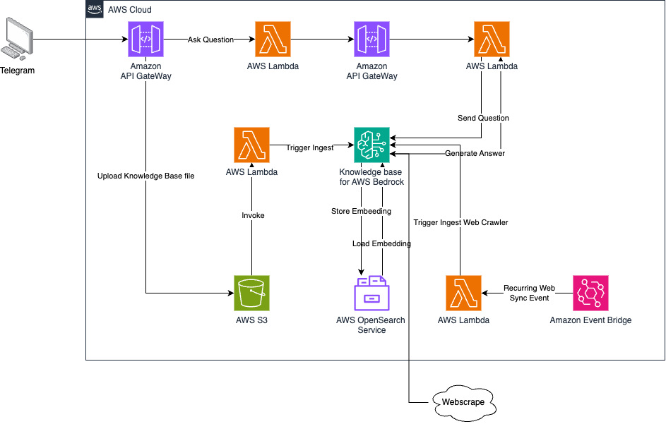
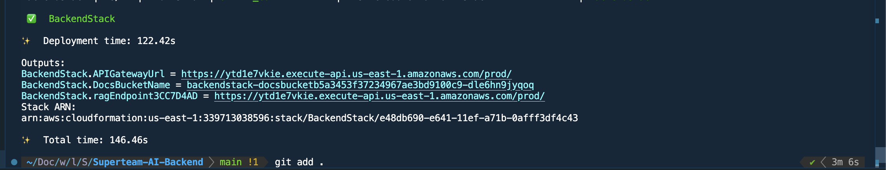
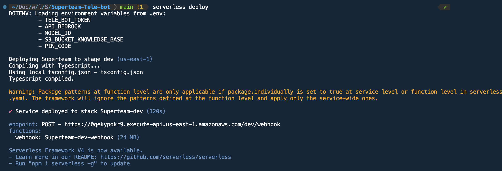

# SuperTeam AI Tele Bot 🤖

This project implements SuperTeam AI Tele Bot, allowing users to interact via Telegram to ask questions about SuperTeam VN.
Additionally, SuperTeam Admins can update the AI’s knowledge base through the bot. We utilize AWS Bedrock as the AI engine, integrating a Knowledge Base (RAG - Retrieval-Augmented Generation) to control responses.

## 📌 Project Repositories

This project consists of two repositories:

1️⃣ **[SuperTeam Tele Bot (Current Repo)]** - Implements the Telegram bot.  
2️⃣ **[SuperTeam AI Backend](https://github.com/minhbear/Superteam-AI-Backend)** - Manages AI interactions and the AWS Bedrock Knowledge Base.

## 🏗 System Architecture



## **🚀 Deployment Guide**

### **Current Project Repo**

### **1️⃣ Prerequisites**

#### **🔧 Required Software**

Before deploying, ensure you have the following installed:

- [AWS CLI](https://docs.aws.amazon.com/cli/latest/userguide/install-cliv2.html) and configured **AWS Profile**
- [Serverless Framework](https://www.serverless.com/framework/docs/getting-started)

#### **🤖 Telegram Bot Setup**  
1. Follow this guide to **create a Telegram bot**: [How to Create a Telegram Bot](https://flowxo.com/how-to-create-a-bot-for-telegram-short-and-simple-guide-for-beginners/)  
2. Obtain the **Telegram bot token**.  

#### **📂 Data Setup**  
1. **Deploy the AI Backend Repo** first. Follow the README in the AI repo.  
2. Once deployed, retrieve:  
   - **API Endpoint** for AWS Bedrock  
   - **S3 Bucket Name** for storing knowledge base data  


---
## **📄 Environment Variables Configuration**  
- Create an .env file, copy the token tele, API bedrock and S3 document Data Source

```env
TELE_BOT_TOKEN=<token>
API_BEDROCK=<Copy address show when deploy AI repo>
MODEL_ID=amazon.titan-text-premier-v1:0 # Can change
S3_BUCKET_KNOWLEDGE_BASE=<Copy S3 bucket name show when deploy AI repo>
PIN_CODE=11111 # Can change
```

## **📄 Update serverless.yml**

- change the bucket-name **"arn:aws:s3:::<"bucket-name">/\*"** to bucket name data source for S3, this will allow out Tele Lambda had permission to upload knowledge base file to S3.

### 🚀 Deployment Steps

#### 1️⃣ Deploy Lambda

```
serverless deploy
```
Result


#### 2️⃣ Connect Telegram Bot to Lambda

```
curl --request POST --url "https://api.telegram.org/bot<tele-bot-token>/setWebhook" --header 'content-type: application/json' --data '{"url": "<lambda-api>"}'
```
Result
```
{"ok":true,"result":true,"description":"Webhook was set"}%
```

### Demo
Watch in Demo-AI.mov